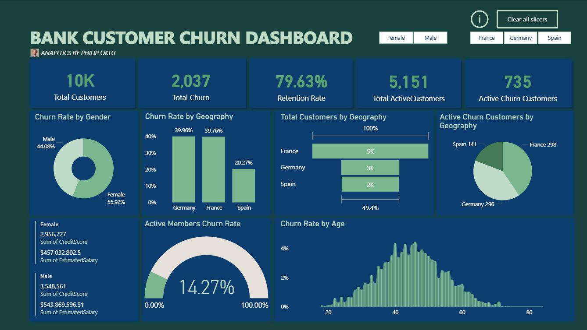

# BANK-CUSTOMER-CHURN-DASHBOARD-V2

This project contains a Power BI dashboard designed to explore customer churn in a multinational bank setting. It visualizes key patterns and segments churn behavior across different **countries, age groups, and genders**.

---

## 📊 Dashboard Overview

---

## 🔍 Key Metrics

- **Total Customers:** 10,000  
- **Churned Customers:** 2,037  
- **Retention Rate:** 79.63%  
- **Active Churn Customers:** 735  
- **Top Churn Countries:** Germany & France (~40% churn each)

---

## 📈 Visuals Include:

- Churn Rate by Gender & Geography
- Total Customers & Churn by Region
- Salary & Credit Score Distribution by Gender
- Churn by Age
- Active Members Churn Rate

---

## 🛠 Tools Used

- Power BI (Dashboard and Interactions)
- Excel (Data Cleaning & Aggregation)
- GitHub (Version Control)

---

## 📁 File

- `Capture.JPG` – Dashboard preview (Page 1)

---

## 📬 Contact

**Philip Oklu**  
📧 philo.deyes@gmail.com  
🌍 Abeokuta, Nigeria  
🔗 [GitHub](https://github.com/PhilipOklu)

---

## 🏷 GitHub Topics

`powerbi`, `banking`, `churn-analysis`, `data-visualization`, `customer-retention`, `geographical-insights`, `business-intelligence`

---

## 📄 License

This project is licensed under the [MIT License](LICENSE).
